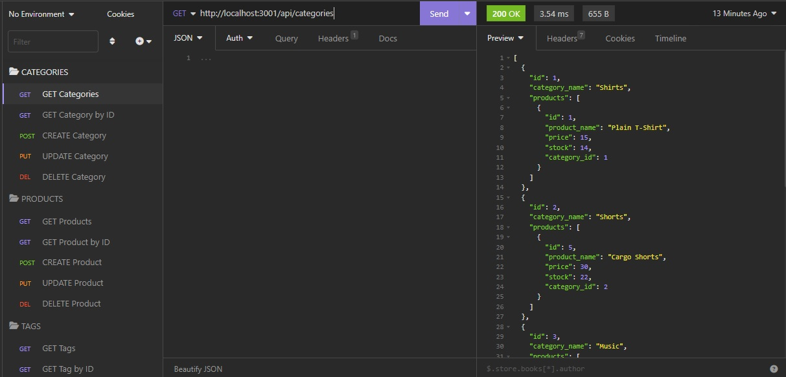

# E-Commerce Back End

## Description

This is a demonstration of an editable database that can be used to run the back end of an e-commerce business. Categories, products, and tags can be created, updated, and deleted.

## Usage/Preview

After cloning this repository, users must get the database up and running by creating their own .env file containing the database information as well as their own MySQL login info then running "source db/schema.sql" from inside the base folder. Then, users will be free to exit out of the MySQL shell and seed the database by running "npm run seed". Finally, to run the application, users can simply run "npm run start".

The database will then be viewable as well as editable as long as the application is running in the user's terminal. The preferred method of perusing the database would be through Insomnia.

Users can create GET requests to view categories, products, and tags. They will also be able to create the aforementioned objects by creating valid POST requests, update by creating valid PUT requests, and delete by creating valid DELETE requests.

To reset the database to its original state, users must re-run "npm run seed".

[Demo video here](https://youtu.be/k5zezQoMjsU)

## Technologies Used
* Node.js
* Express.js
* mySQL
* Sequelize
* Insomnia

## Credits

Starter code provided by The Coding Boot Camp @ UCSD.

## License

N/A